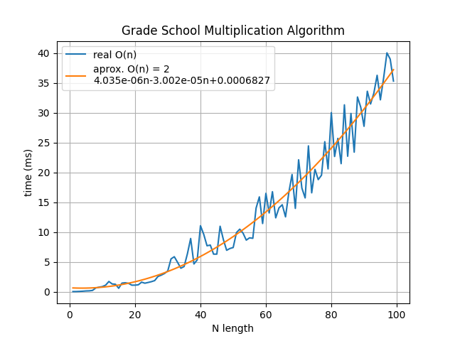

### Algoriths Design
course.


### Grade School Multiplication
```python
from algorithms.operations import grade_school_multiplication


result = grade_school_multiplication(5678, 1234)
print(result)
```
