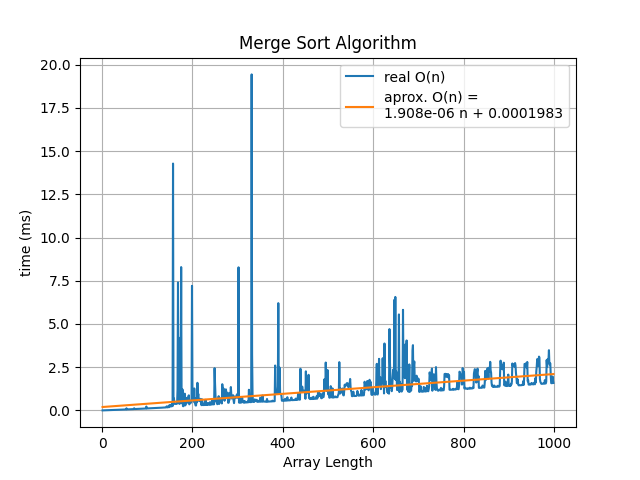

### Algoriths Design
course.


### Grade School Multiplication
```python
from algorithms.operations import grade_school_multiplication


result = grade_school_multiplication(5678, 1234)
print(result)
```


### Merge Sort
```python
from algorithms.sort import merge_sort


array = [12, 10, 13, 5, 6, 7, 2]
sorted_ = merge_sort(array)

print("input: ", array)
print("output: ", sorted_)

```

